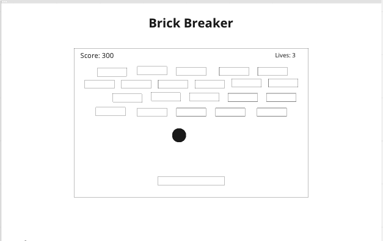
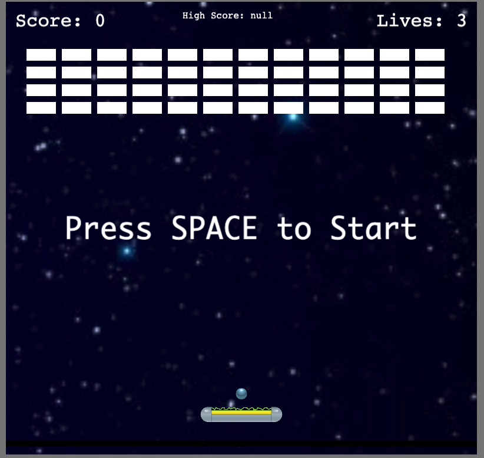
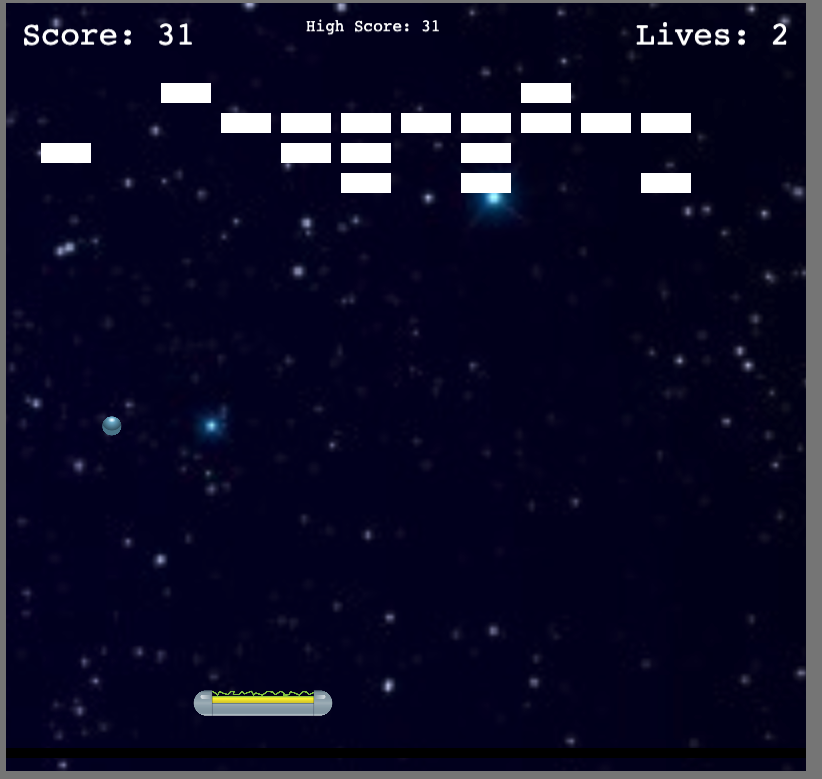

# BREAKOUT

### Summary

| Field        |                          Detail                           |
| ------------ | :-------------------------------------------------------: |
| Project Name |                        Breakout                         |
| Description  |             Brick Breaker Game              |
| Developers   |           Nathan Yi           |
| Live Website |       [Live Site](https://breakout-ny.netlify.app)        |
| Repo         | [GitHub](https://github.com/yinathan/breakout-game) |
| Miro         |  [Miro Board](https://miro.com/app/board/uXjVOgFJpkk=/)   |

### Technologies Used

    HTML, CSS, Javascript, Node.js, Phaser.io

### User Stories
- AAU I want to be able to start the game
- AAU I want to move the paddle with my mouse
- AAU I want to see how many lives i currently have
- AAU I want to see my current score
- AAU I want to see my high score saved in local storage
- AAU I want to be able to play multiple levels

### Wireframe

### Live Site

Game Start

Signup Page

### Future Enhancements

- Add multiple levels to the game using a json file
- Customize bricks with images, instead of rectangle groups
- Add keyboard arrow key functionality for paddle
- Create a definite end game screen with a restart button
